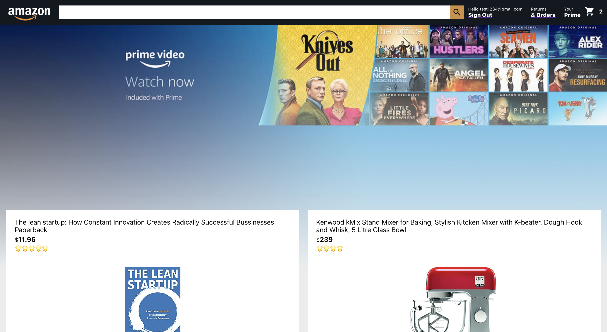

# Amazon-Clone-app

This is an Amazon Clone written in  HTML, CSS, Javascript, and NodeJs. It uses React, ExpressJs, Cloud Firestore for login authentication and is deployed with Firebase hosting.

<strong>View application <a href="https://clone-e30b3.web.app//"><b>here</b></a>.</strong>

# Summary
This is an Amazon clone with full E-commerce functionality. This clone includes a responsive UI, add to basket functionality, order checkout processing, and sign in functionality allowing the user to create an account and login. This application uses React router to keep the UI in sync with the URL and uses Redux in the form of the React Context API. It uses React's Context API (in the basket page) and custom hooks in order to manage states without resorting to props drilling. Every component uses a useState() hook in order to update state. It also uses Stripe as the payment processing. Stripe checkout captures the users card details on the front-end and uses Firebase Cloud functions to power functionality. 

# Author
<strong>Mauro Leos</strong> - <i>Full-Stack Software Developer</i> - <a href="https://www.linkedin.com/in/mauro-leos-b4103a11b/">LinkedIn </a> - <a href="https://www.mauroleos.com//">Website</a>

